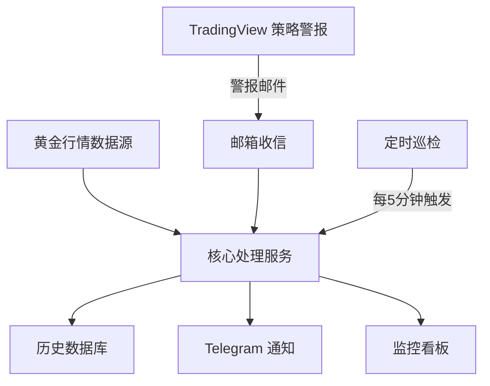
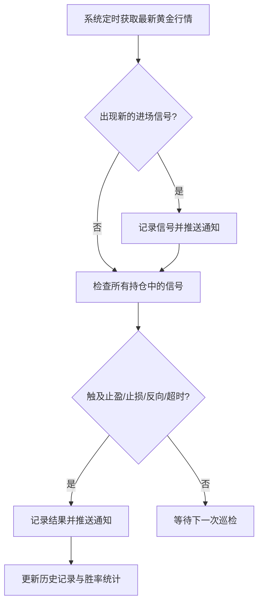

# 项目介绍

一套 24 小时自动运行的黄金(XAUUSD)交易信号助手:一边把交易策略触发的警报邮件自动转发到 Telegram,一边独立按同一套策略规则重新计算每一次进出场,记录完整的止盈、止损结果,方便随时回顾这套策略的历史表现。

## 主要功能

- **实时警报转发**:策略在 TradingView 上触发警报后,系统会自动收信并转发到 Telegram,不需要人工盯盘。
- **独立信号复核引擎**:系统会自己抓取实时黄金行情,按策略规则判断进场时机,并全程追踪每一笔信号是止盈、止损、被反向信号平仓,还是因为开仓太久被自动放弃。
- **Telegram 即时通知**:每次出现新信号、每次止盈/止损/平仓,都会第一时间推送消息。
- **密码保护的监控看板**:一个网页,随时查看系统是否正常运行、最近收到了哪些警报。
- **历史数据导出**:可以导出全部信号记录,以及一份整体的胜率统计。
- **自动化运维**:每 5 分钟自动巡检一次系统是否还活着,每周自动备份一次历史数据,即使服务器重启也不会丢失记录。

## 技术栈

| 技术 | 作用 |
|---|---|
| Python + FastAPI | 系统的运行引擎,负责定时任务、网页和数据接口 |
| Twelve Data | 提供实时黄金价格数据的行情服务 |
| Telegram Bot | 把交易信号实时推送到 Telegram |
| Gmail | 代收策略平台发来的警报邮件 |
| Supabase(云端数据库) | 永久保存历史信号记录,服务器重启也不会丢数据 |
| Render | 系统实际运行的云端服务器,不需要自己买/管主机 |
| GitHub Actions | 每 5 分钟自动巡检一次系统、每周自动备份一次数据 |

## 系统架构

## 核心流程

