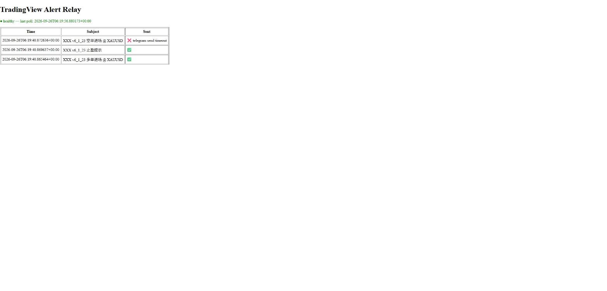
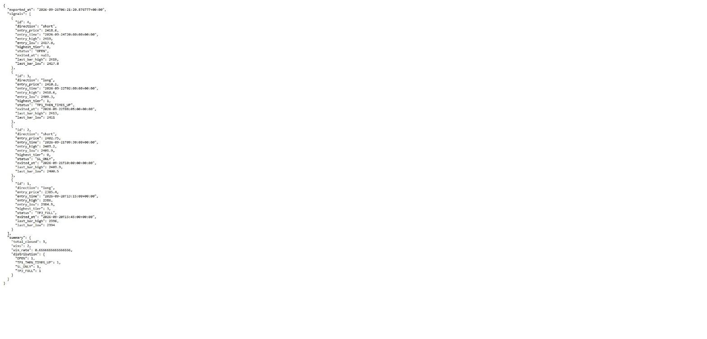
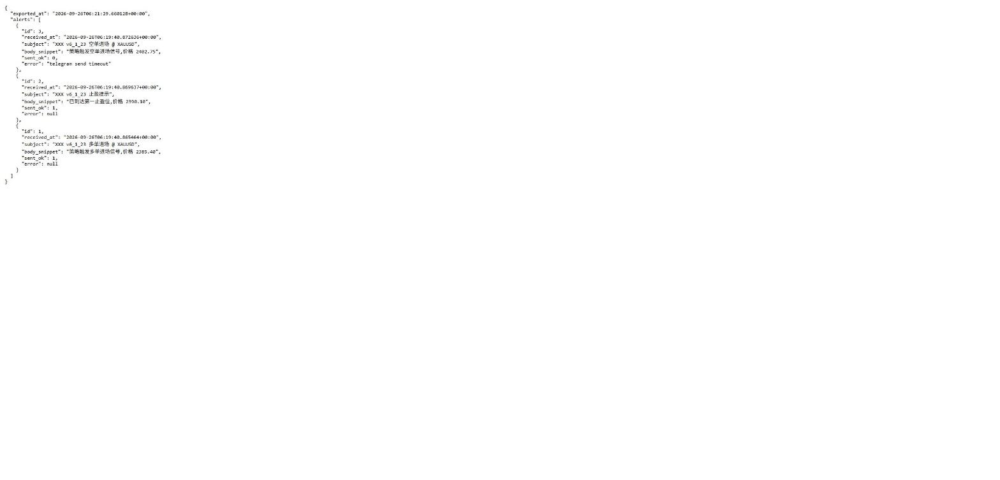

# 使用教学

## 开始之前你需要知道的事

- 这个系统**全自动运行**:收警报、判断信号、发通知、记录结果都是自动发生的,你平时不需要手动操作什么。
- 系统只有**一个查看网址**,用来查看运行状态和历史记录,没有"新增/编辑"这类功能,也没有区分管理员和普通员工——只要有网址和密码,看到的内容都一样。
- 打开网址时,浏览器会弹出一个**系统自带的账号密码框**(不是网页上的登录表单,长得像下图这种、不同浏览器样式略有差异):

  > 用户名:____________
  > 密码:______________
  > [ 取消 ]  [ 登录 ]

  输入负责人提供给你的账号和密码即可,浏览器通常会记住,之后不用每次都输入。

---

## 任务一:打开监控看板查看系统状态

1. 在浏览器地址栏输入负责人提供的网址(形如 `https://xxxx.onrender.com`),回车。
2. 浏览器弹出账号密码框,输入负责人提供的账号密码,点登录。
3. 你会看到如下画面:

   

   画面说明:
   - 页面左上角一行绿色的 **● healthy**,表示系统运行正常;如果显示红色的 **● unhealthy**,说明系统可能出问题了(常见原因见下方"常见问题")。
   - 下面的表格是最近的警报转发记录:**Time** 是收到警报的时间,**Subject** 是警报标题,**Sent** 一栏 ✅ 表示已成功转发到 Telegram,❌ 表示转发失败(后面会显示失败原因)。

---

## 任务二:看懂 Telegram 通知

系统会在下面几种情况下,主动往 Telegram 发消息,不需要你去网页上查:

| 收到的消息 | 含义 |
|---|---|
| 📈 (警报标题 + 内容摘要) | 策略在 TradingView 上触发了一次警报,系统把邮件内容转发给你 |
| 📊 Signal Entry #编号 / LONG 或 SHORT @ 价格 / 时间 | 独立信号引擎自己判断出现了一次新的进场信号(多单或空单) |
| 🏁 Signal #编号 closed: 结果 | 一笔信号结束了,后面的"结果"会是下面几种之一:止盈到底(TP3_FULL)、止盈后止损(TP1_THEN_SL / TP2_THEN_SL)、只止损(SL_ONLY)、被反向信号平仓(REVERSED_ONLY / TP1_THEN_REVERSED / TP2_THEN_REVERSED)、开仓太久被自动放弃(TIMES_UP / TP1_THEN_TIMES_UP / TP2_THEN_TIMES_UP) |
| 🔄 Signal #编号 closed: 结果 | 出现了反方向的新信号,系统把原来那笔还开着的信号平仓了 |

只要看到 🏁 或 🔄 开头的消息,就说明这笔信号已经结束、有了最终结果。

---

## 任务三:查看历史信号与胜率

1. 在浏览器地址栏输入网址后面加上 `/signals/export`(形如 `https://xxxx.onrender.com/signals/export`),回车。
2. 浏览器同样会弹出账号密码框,输入账号密码。
3. 你会看到一大段文字(这是系统原始的数据格式,不是特意设计的表格,如下图):

   

   关键字段怎么读:
   - `signals`:每一笔信号的详细记录。`direction` 是方向(long 多单/short 空单),`entry_price`/`entry_time` 是进场价格和时间,`status` 是最终结果(含义同上一节的表格),`status` 为 `OPEN` 表示这笔信号还没结束。
   - `summary.total_closed`:已经结束的信号总数。
   - `summary.wins`:算作"赢"的信号数(止盈过、或被反向平仓/放弃时已经至少到过第一止盈)。
   - `summary.win_rate`:胜率,`0.6666...` 表示约 67%。
   - `summary.distribution`:各种结果分别出现了多少次。

---

## 任务四:查看邮件转发历史

1. 在浏览器地址栏输入网址后面加上 `/export`,回车,输入账号密码。
2. 会看到警报转发的完整历史记录(如下图),字段含义和监控看板表格一致:

   

---

## 常见问题

**Q:很久没收到 Telegram 消息,是不是系统坏了?**
不一定。系统只在真正出现新信号、或信号结束时才会发消息,如果市场一直没有触发条件,长时间没消息是正常的。可以先打开监控看板确认是不是显示 **● healthy**。

**Q:监控看板显示 ● unhealthy 怎么办?**
说明系统最近轮询失败次数过多,或者太久没有成功巡检。联系负责人处理即可,不需要你自己修复。

**Q:"TIMES_UP(弃单)"是什么意思,是不是系统出错了?**
不是。为了避免一笔信号无限期"挂着不结束",系统规定一笔信号如果开仓超过一定的真实交易时间(自动排除周末休市)还没有触及止盈或止损,就会按当时的价格自动结算、标记为 TIMES_UP,不计入止盈或止损的统计,只按当时有没有到过止盈来算胜负。

**Q:胜率(win_rate)看起来会变化,是数据不准吗?**
胜率是根据**目前已经结束**的信号动态计算的,新的信号结束后胜率就会重新计算,属于正常波动,历史已结束的信号记录本身不会被修改。

**Q:网址打不开/提示网页无法访问怎么办?**
先确认网址有没有输入错误;如果确定网址没问题,联系负责人确认服务器是否在正常运行。

**Q:密码框输错了账号密码怎么办?**
重新打开网址再试一次;如果确定密码没问题但一直登录不了,联系负责人确认账号密码是否有变更。
